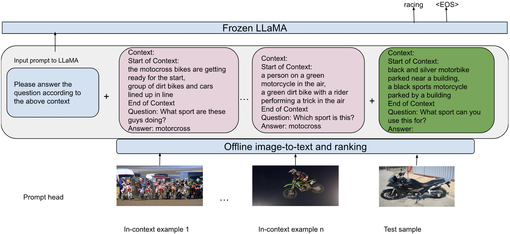

# A-Simple-Baseline-For-Knowledge-Based-VQA
Repo for the EMNLP 2023 paper "A Simple Knowledge-Based Visual Question Answering"

[](https://arxiv.org/pdf/2310.13570.pdf)


>  Inference-time of our method for n-shot VQA..

## Abstract
This paper is on the problem of KnowledgeBased Visual Question Answering (KB-VQA).
Recent works have emphasized the significance
of incorporating both explicit (through external
databases) and implicit (through LLMs) knowledge to answer questions requiring external
knowledge effectively. A common limitation
of such approaches is that they consist of relatively complicated pipelines and often heavily
rely on accessing GPT-3 API. Our main contribution in this paper is to propose a much simpler and readily reproducible pipeline which,
in a nutshell, is based on efficient in-context
learning by prompting LLaMA (1 and 2) using
question-informative captions as contextual information. Contrary to recent approaches, our
method is training-free, does not require access
to external databases or APIs, and yet achieves
state-of-the-art accuracy on the OK-VQA and
A-OK-VQA datasets. Finally, we perform several ablation studies to understand important
aspects of our method. Our code is publicly
available at https://github.com/alexandrosXe/ASimple-Baseline-For-Knowledge-Based-VQA

## Install
First, please install the necessary dependencies:
```bash
pip install -r requirements.txt
```
## Usage
First, download the LLaMA weights and convert them to Huggingface format:
* Weights for the LLaMA models can be obtained from by filling out this [form](https://docs.google.com/forms/d/e/1FAIpQLSfqNECQnMkycAp2jP4Z9TFX0cGR4uf7b_fBxjY_OjhJILlKGA/viewform)
* After downloading the weights, they will need to be converted to the Hugging Face Transformers format using the conversion [script](https://huggingface.co/docs/transformers/main/model_doc/llama).

To run the code use the run_main.sh script!
```bash
python main.py \
    --dataset ok_vqa \
    --evaluation_set val \
    --train_annotations_path annotations/ok_vqa/train_annots_fixed.csv.zip \
    --val_annotations_path annotations/ok_vqa/val_annots_fixed.csv.zip \
    --test_annotations_path None \
    --train_images_dir /path_to_the_train_images/ \
    --val_images_dir /path_to_the_val_images/ \
    --test_images_dir None \
    --n_shots 10 \
    --k_ensemble 5 \
    --no_of_captions 9 \
    --use_mcan_examples False \
    --mcan_examples_path mcan_examples/ok_vqa/examples.json \
    --llama_path meta-llama/Llama-2-13b-hf \
    --train_captions_path question_related_captions/ok_vqa/train_data_qr_captions_csv \
    --val_captions_path question_related_captions/ok_vqa/val_data_qr_captions_csv \
    --test_captions_path None \
    --blip_train_question_embedds_path blip_embedds/ok_vqa/blip_normalized_q_embedds/blip_train_question_embedds.csv.zip \
    --blip_train_image_embedds_path blip_embedds/ok_vqa/blip_normalized_i_embedds/blip_train_image_embedds.csv.zip \
    --blip_val_question_embedds_path blip_embedds/ok_vqa/blip_normalized_q_embedds/blip_val_question_embedds.csv.zip \
    --blip_val_image_embedds_path blip_embedds/ok_vqa/blip_normalized_i_embedds/blip_val_image_embedds.csv.zip \
    --path_to_save_preds results/ok_vqa_val_without_mcan_llama2.csv
```
*Note that you must include the paths to the train, val, and test images

## Results
See the "results" folder for the results reported in the main paper


## Citation

If you find our work useful, please consider citing our paper:

```bibtex
@inproceedings{xenos-etal-2023-simple,
    title = "A Simple Baseline for Knowledge-Based Visual Question Answering",
    author = "Xenos, Alexandros  and
      Stafylakis, Themos  and
      Patras, Ioannis  and
      Tzimiropoulos, Georgios",
    editor = "Bouamor, Houda  and
      Pino, Juan  and
      Bali, Kalika",
    booktitle = "Proceedings of the 2023 Conference on Empirical Methods in Natural Language Processing",
    month = dec,
    year = "2023",
    address = "Singapore",
    publisher = "Association for Computational Linguistics",
    url = "https://aclanthology.org/2023.emnlp-main.919",
    pages = "14871--14877",
    abstract = "This paper is on the problem of Knowledge-Based Visual Question Answering (KB-VQA). Recent works have emphasized the significance of incorporating both explicit (through external databases) and implicit (through LLMs) knowledge to answer questions requiring external knowledge effectively. A common limitation of such approaches is that they consist of relatively complicated pipelines and often heavily rely on accessing GPT-3 API. Our main contribution in this paper is to propose a much simpler and readily reproducible pipeline which, in a nutshell, is based on efficient in-context learning by prompting LLaMA (1 and 2) using question-informative captions as contextual information. Contrary to recent approaches, our method is training-free, does not require access to external databases or APIs, and yet achieves state-of-the-art accuracy on the OK-VQA and A-OK-VQA datasets. Finally, we perform several ablation studies to understand important aspects of our method. Our code is publicly available at https://github.com/alexandrosXe/ASimple-Baseline-For-Knowledge-Based-VQA",
}
```

## Contact

**Please feel free to get in touch at**: ` a.xenos@qmul.ac.uk`
